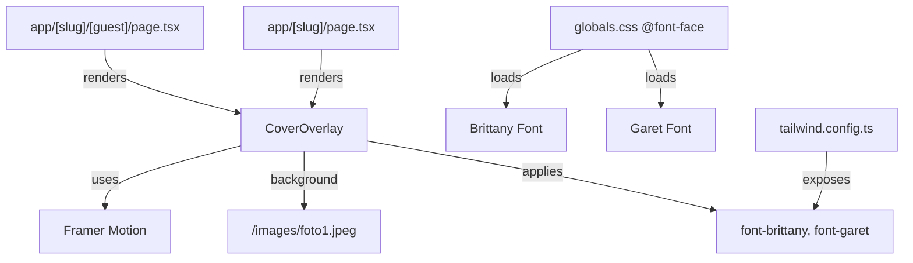

# Design Document: Cover Page Redesign

## Overview

This design covers the redesign of the `CoverOverlay` component from an ornament-heavy slideshow layout to a clean, minimal cover page with a single static background photo, custom typography, and smooth Framer Motion animations.

The redesign touches six files across the codebase:
1. `app/components/CoverOverlay.tsx` — Complete component rewrite
2. `app/globals.css` — `@font-face` declarations for Brittany and Garet
3. `tailwind.config.ts` — Font family utility classes
4. `app/data/content.ts` — Default couple names update (Satria & Heppa)
5. `app/[slug]/[guest]/page.tsx` — Default names in `parseNames` fallback
6. `app/[slug]/page.tsx` — Default names in `parseNames` fallback

Font files (`Brittany.woff2`/`.woff`/`.ttf`, `Garet-Book.woff2`/`.woff`/`.ttf`) will be placed in `public/fonts/`.

## Architecture

The architecture remains unchanged — `CoverOverlay` is a client component rendered conditionally by the page routes. The redesign is purely presentational with no new state management, API calls, or routing changes.



### Key Architectural Decisions

1. **Local font files via `@font-face` in `globals.css`** rather than `next/font/local` in `layout.tsx`. Rationale: Brittany and Garet are custom fonts (not Google Fonts), and `@font-face` in CSS is the simplest approach that works with Tailwind utility classes without needing CSS variable wiring through the layout component tree. The existing Google Fonts (Playfair, Great Vibes) remain loaded via `next/font/google` in `layout.tsx` for other sections of the invitation.

2. **Single static `<div>` with `background-image`** instead of `<Image>` component. Rationale: The background is purely decorative, fills the entire viewport, and needs `background-size: cover` + `background-position: center` behavior. A CSS background on a `div` is simpler and avoids Next.js Image optimization overhead for a full-bleed decorative image.

3. **Framer Motion `motion.div` wrappers with staggered delays** for entrance animations. The top group (couple names) slides down, the bottom group (guest info) slides up, creating a symmetrical reveal effect.

## Components and Interfaces

### CoverOverlay Component

The component interface remains the same — no breaking changes to the props contract:

```typescript
interface CoverOverlayProps {
  onOpen: () => void;
  groom?: string;   // default: "Satria"
  bride?: string;    // default: "Heppa"
  guestName?: string; // default: "Tamu Undangan"
}
```

### Internal Structure

The component renders this DOM structure:

```
<AnimatePresence>
  <motion.div>                          // Full-screen fixed container, exit fade-out
    <div />                             // Background image (foto1.jpeg, bg-cover, bg-center)
    <div />                             // Dark overlay (bg-black/50)
    <motion.div>                        // Top group — slides down, fades in
      <h1 class="font-brittany">       // Couple names: "{groom} & {bride}"
    </motion.div>
    <motion.div>                        // Bottom group — slides up, fades in
      <p class="font-garet">           // "Kepada Bapak/Ibu/Saudara/i."
      <p class="font-garet font-bold"> // Guest name
      <button class="font-garet">      // "Buka Undangan" with envelope SVG icon
      <p class="font-garet">           // Disclaimer text
    </motion.div>
  </motion.div>
</AnimatePresence>
```

### Removed Elements
- Slideshow images array and `currentSlide` state + interval
- Top ornament SVG ``
- "UNDANGAN" heading `<p>`
- Date text `<p>`
- Bottom ornament SVG ``

### Animation Specifications

| Element | Type | Initial | Animate | Delay | Duration |
|---------|------|---------|---------|-------|----------|
| Couple names (top) | fade + slide down | `opacity: 0, y: -30` | `opacity: 1, y: 0` | 0.3s | 0.8s |
| Guest greeting | fade + slide up | `opacity: 0, y: 30` | `opacity: 1, y: 0` | 0.5s | 0.8s |
| Guest name | fade + slide up | `opacity: 0, y: 30` | `opacity: 1, y: 0` | 0.7s | 0.8s |
| Open button | fade + slide up | `opacity: 0, y: 30` | `opacity: 1, y: 0` | 0.9s | 0.8s |
| Disclaimer | fade in | `opacity: 0` | `opacity: 1` | 1.1s | 0.6s |
| Cover (exit) | fade out | `opacity: 1` | `opacity: 0` | — | 0.8s, ease-in-out |

### Font Configuration

**globals.css additions:**

```css
@font-face {
  font-family: 'Brittany';
  src: url('/fonts/Brittany.woff2') format('woff2'),
       url('/fonts/Brittany.woff') format('woff'),
       url('/fonts/Brittany.ttf') format('truetype');
  font-weight: normal;
  font-style: normal;
  font-display: swap;
}

@font-face {
  font-family: 'Garet';
  src: url('/fonts/Garet-Book.woff2') format('woff2'),
       url('/fonts/Garet-Book.woff') format('woff'),
       url('/fonts/Garet-Book.ttf') format('truetype');
  font-weight: normal;
  font-style: normal;
  font-display: swap;
}
```

**tailwind.config.ts additions** (inside `theme.extend.fontFamily`):

```typescript
brittany: ["Brittany", "cursive"],
garet: ["Garet", "sans-serif"],
```

This enables `font-brittany` and `font-garet` Tailwind utility classes with appropriate fallbacks.

### Default Names Update

**`app/data/content.ts`**: Change `groom.name` from `"Satria"` to `"Satria"` and `bride.name` from `"Heppa"` to `"Heppa"`.

**`app/[slug]/[guest]/page.tsx`** and **`app/[slug]/page.tsx`**: Change the `parseNames` fallback from `{ groom: "Satria", bride: "Heppa" }` to `{ groom: "Satria", bride: "Heppa" }`.

**`app/components/CoverOverlay.tsx`**: Change default prop values from `groom = "Satria"`, `bride = "Heppa"` to `groom = "Satria"`, `bride = "Heppa"`.

## Data Models

No new data models are introduced. The existing `CoverOverlayProps` interface is unchanged (only default values change). The `WeddingContent` type and `weddingContent` object structure remain the same — only the `groom.name` and `bride.name` values are updated.

## Error Handling

1. **Font loading failure**: Both `@font-face` declarations use `font-display: swap` so text renders immediately with fallback fonts (`cursive` for Brittany, `sans-serif` for Garet) and swaps when the custom font loads. No JavaScript error handling needed.

2. **Background image failure**: If `foto1.jpeg` fails to load, the dark overlay (`bg-black/50`) over the wedding background color (`#1a0e0a`) ensures text remains readable. No broken image icon appears since it's a CSS `background-image`.

3. **Missing guest name**: The component defaults to `"Tamu Undangan"` when no `guestName` prop is provided, matching current behavior.

4. **Animation failure**: Framer Motion animations degrade gracefully — if JS fails to execute, the component renders in its final animated state (opacity 1, no transform) since the exit animation only triggers on user interaction.

## Testing Strategy

### Why Property-Based Testing Does Not Apply

This feature is a UI component redesign focused on:
- Visual layout and styling (CSS, Tailwind classes)
- Font configuration (`@font-face`, Tailwind config)
- Animation behavior (Framer Motion)
- Static default value changes

There are no pure functions with meaningful input variation, no data transformations, no parsers or serializers being added. The `parseNames` function already exists and is not being modified in logic — only its fallback default values change. PBT would not provide value here.

### Recommended Testing Approach

**Manual visual testing** is the primary validation method for this redesign, since the requirements are about visual appearance, font rendering, and animation smoothness.

**Example-based unit tests** (if desired) could cover:
- `CoverOverlay` renders with default names "Satria" & "Heppa"
- `CoverOverlay` renders provided `groom`, `bride`, `guestName` props
- `CoverOverlay` does not render slideshow elements, ornaments, "UNDANGAN" heading, or date
- `CoverOverlay` calls `onOpen` when button is clicked
- `parseNames` fallback returns `{ groom: "Satria", bride: "Heppa" }`
- Font classes (`font-brittany`, `font-garet`) are applied to correct elements

**Snapshot tests** could capture the rendered component structure to detect unintended regressions.

**Cross-browser testing** should verify font rendering of Brittany and Garet across Chrome, Safari, Firefox, and mobile browsers.
