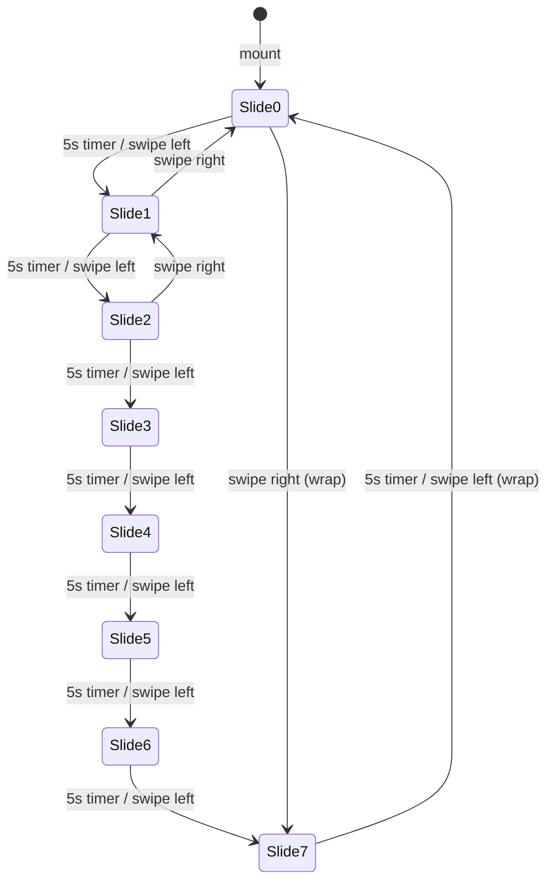

# Design Document: Hero Section Redesign

## Overview

This design replaces the current video-background Hero Section with a photo slideshow-based layout that integrates the countdown timer, a Sanskrit quote, and a "Save The Date" label into a single full-screen section. The standalone `CountdownTimer` section rendered after `HeroSection` in both page routes (`app/[slug]/page.tsx` and `app/[slug]/[guest]/page.tsx`) will be removed, since its functionality is absorbed into the redesigned Hero Section.

The redesigned component follows a vertical layout:
1. Top — "WE ARE GETTING MARRIED" header (Garet, uppercase, letter-spaced)
2. Below header — Couple names in Brittany script font (large, focal point)
3. Middle — Sanskrit quote in italic Garet with source reference
4. Bottom row — Countdown timer (2×2 grid, bottom-left) and "Save The Date" (Brittany, bottom-right)

A crossfade photo slideshow (foto2–foto9.jpeg) runs behind a dark overlay, with touch swipe support for manual navigation.

## Architecture

### Component Structure

```
HeroSection (rewritten)
├── SlideshowBackground        — manages image cycling, crossfade, swipe
│   ├── Image layers (absolute, stacked with opacity transitions)
│   └── Dark overlay div
├── HeaderText                  — "WE ARE GETTING MARRIED"
├── CoupleNames                 — "{groom} & {bride}"
├── SanskritQuote               — quote text + source
└── BottomRow
    ├── CountdownGrid           — 2×2 grid (hari/jam, menit/detik)
    └── SaveTheDateLabel        — "Save The Date"
```

All sub-elements are inline within the single `HeroSection` component file — no new component files are created. The slideshow logic (auto-advance timer, swipe handling, current index state) lives inside `HeroSection` via React hooks.

### Integration with Page Routes

Both `app/[slug]/page.tsx` and `app/[slug]/[guest]/page.tsx` currently render:

```tsx
<AnimatedSection>
  <HeroSection groom={groom} bride={bride} />
</AnimatedSection>
<AnimatedSection>
  <CountdownTimer />
</AnimatedSection>
```

After the redesign:
- The `<CountdownTimer />` section and its wrapping `<AnimatedSection>` are removed from both page files.
- The `CountdownTimer` import is removed from both page files.
- `HeroSection` continues to receive `groom` and `bride` props — no API change.

The existing `app/components/CountdownTimer.tsx` file and `app/utils/countdown.ts` utility are kept in the codebase (other sections may reference them in the future), but `CountdownTimer.tsx` is no longer imported by the page routes.

### Slideshow Mechanism



- 8 images: `foto2.jpeg` through `foto9.jpeg`
- Auto-advance interval: 5 seconds
- Transition: crossfade via Framer Motion `AnimatePresence` with opacity animation (~700ms duration)
- Swipe: track `touchstart`/`touchend` X coordinates; threshold of 50px triggers advance/reverse
- Each swipe resets the auto-advance timer to avoid immediate double-advance

## Components and Interfaces

### HeroSection Props (unchanged)

```typescript
interface HeroSectionProps {
  groom?: string;  // default: "Anggita"
  bride?: string;  // default: "Cindy"
}
```

### Internal State

```typescript
// Slideshow
const [currentSlide, setCurrentSlide] = useState(0);
const touchStartX = useRef<number | null>(null);

// Countdown (absorbed from CountdownTimer)
const [countdown, setCountdown] = useState<CountdownResult>({
  days: 0, hours: 0, minutes: 0, seconds: 0,
});
const [mounted, setMounted] = useState(false);
```

### Slideshow Images Array

```typescript
const SLIDESHOW_IMAGES = [
  "/images/foto2.jpeg",
  "/images/foto3.jpeg",
  "/images/foto4.jpeg",
  "/images/foto5.jpeg",
  "/images/foto6.jpeg",
  "/images/foto7.jpeg",
  "/images/foto8.jpeg",
  "/images/foto9.jpeg",
];
```

### Countdown Integration

Reuses `calculateCountdown` from `app/utils/countdown.ts` directly. The countdown labels use Indonesian terms:

| Key       | Label  |
|-----------|--------|
| days      | Hari   |
| hours     | Jam    |
| minutes   | Menit  |
| seconds   | Detik  |

### Quote Data

Sourced from `weddingContent.quote` in `app/data/content.ts`:
- `weddingContent.quote.sanskrit` — the quote body
- `weddingContent.quote.source` — "RGVEDA : X.85.36"

### Swipe Gesture Handling

```typescript
const handleTouchStart = (e: React.TouchEvent) => {
  touchStartX.current = e.touches[0].clientX;
};

const handleTouchEnd = (e: React.TouchEvent) => {
  if (touchStartX.current === null) return;
  const diff = touchStartX.current - e.changedTouches[0].clientX;
  if (Math.abs(diff) > 50) {
    if (diff > 0) nextSlide();   // swipe left → next
    else prevSlide();             // swipe right → prev
  }
  touchStartX.current = null;
};
```

### Layout Structure (JSX outline)

```
<section className="relative h-screen w-full overflow-hidden">
  {/* Slideshow background images (absolute, stacked) */}
  {/* Dark overlay */}
  
  <div className="relative z-10 flex flex-col justify-between h-full px-6 py-12">
    {/* Top area */}
    <div className="text-center">
      <p>WE ARE GETTING MARRIED</p>   {/* font-garet, uppercase, tracking-[0.3em] */}
      <h1>{groom} & {bride}</h1>       {/* font-brittany, text-5xl+ */}
    </div>

    {/* Middle area */}
    <div className="text-center">
      <p>{sanskrit quote}</p>           {/* font-garet, italic */}
      <p>{source}</p>                   {/* font-garet, small */}
    </div>

    {/* Bottom area */}
    <div className="flex justify-between items-end">
      {/* Left: Countdown 2x2 grid */}
      <div className="grid grid-cols-2 gap-2">
        <CountdownUnit value={days} label="Hari" />
        <CountdownUnit value={hours} label="Jam" />
        <CountdownUnit value={minutes} label="Menit" />
        <CountdownUnit value={seconds} label="Detik" />
      </div>
      
      {/* Right: Save The Date */}
      <p className="font-brittany">Save The Date</p>
    </div>
  </div>
</section>
```

## Data Models

No new data models are introduced. The component consumes:

1. **`CountdownResult`** from `app/utils/countdown.ts` — `{ days, hours, minutes, seconds }`
2. **`WeddingContent.quote`** from `app/data/content.ts` — `{ sanskrit, translation, source }`
3. **`HeroSectionProps`** — `{ groom?: string, bride?: string }`

All existing types in `app/types/index.ts` remain unchanged.


## Correctness Properties

*A property is a characteristic or behavior that should hold true across all valid executions of a system — essentially, a formal statement about what the system should do. Properties serve as the bridge between human-readable specifications and machine-verifiable correctness guarantees.*

### Property 1: Slideshow index cycling is circular

*For any* array of N images (N > 0) and any current slide index in [0, N), advancing to the next slide SHALL produce `(index + 1) mod N`, and reversing to the previous slide SHALL produce `(index - 1 + N) mod N`. The resulting index is always within [0, N).

**Validates: Requirements 1.3, 1.4, 1.5**

### Property 2: Swipe direction detection

*For any* pair of touch coordinates (startX, endX), if `startX - endX > 50` the detected direction SHALL be "next", if `endX - startX > 50` the detected direction SHALL be "prev", and if `|startX - endX| <= 50` no navigation SHALL occur.

**Validates: Requirements 1.4, 1.5**

### Property 3: Couple name display format

*For any* non-empty groom name and non-empty bride name, the rendered couple names text SHALL contain the exact string `"{groom} & {bride}"`.

**Validates: Requirements 4.1**

## Error Handling

| Scenario | Handling |
|---|---|
| Image fails to load | The slideshow continues cycling; the broken image is skipped visually via the crossfade (the dark overlay ensures no blank flash). A fallback `bg-[#1a0e0a]` background on the section prevents a white screen. |
| Countdown target date has passed | `calculateCountdown` already returns `{ days: 0, hours: 0, minutes: 0, seconds: 0 }` — the component displays zeroes. No special handling needed. |
| Touch events not supported (desktop) | Swipe handlers are no-ops on non-touch devices. The slideshow auto-advances regardless. No mouse-drag equivalent is required. |
| `weddingContent.quote` data missing | The quote section renders empty strings. Since the data is statically defined in `content.ts`, this is not a runtime concern. |
| SSR hydration mismatch for countdown | The countdown initializes to `{ 0, 0, 0, 0 }` and only starts updating after `useEffect` fires (client-side). The `mounted` flag gates display of actual values vs placeholder dashes, matching the existing `CountdownTimer` pattern. |

## Testing Strategy

### Unit Tests (Example-Based)

Focus on specific rendering and behavior checks:

- **Slideshow renders first image on mount** — verify the initial slide is `foto2.jpeg`
- **Auto-advance fires after 5 seconds** — use fake timers to verify slide index increments
- **Dark overlay is rendered** — verify overlay div exists with correct opacity class
- **Header text renders** — verify "WE ARE GETTING MARRIED" text content
- **Sanskrit quote renders** — verify quote text from `weddingContent.quote.sanskrit`
- **Quote source renders** — verify "RGVEDA : X.85.36" text
- **Countdown displays all four units** — mock `Date.now`, verify hari/jam/menit/detik labels
- **Countdown updates every second** — fake timers, advance 1s, verify values change
- **"Save The Date" renders** — verify text content
- **Touch handlers are attached** — verify `onTouchStart`/`onTouchEnd` on the section element
- **Past target date shows zeroes** — set time past 2026-08-17, verify all countdown values are 0

### Property-Based Tests

Using `fast-check` (already in devDependencies). Each test runs minimum 100 iterations.

- **Property 1: Slideshow index cycling** — Generate random array lengths (1–100) and current indices, verify next/prev produce correct modular result and stay in bounds.
  - Tag: `Feature: hero-section-redesign, Property 1: Slideshow index cycling is circular`
- **Property 2: Swipe direction detection** — Generate random (startX, endX) coordinate pairs, verify direction classification matches threshold rules.
  - Tag: `Feature: hero-section-redesign, Property 2: Swipe direction detection`
- **Property 3: Couple name display format** — Generate random non-empty name strings, verify the formatted output contains `"{groom} & {bride}"`.
  - Tag: `Feature: hero-section-redesign, Property 3: Couple name display format`

### What Is NOT Tested with PBT

- Static CSS class presence (font-brittany, font-garet, text-white, etc.) — smoke tests
- Layout positioning (bottom-left, bottom-right, middle) — visual review
- Responsive font scaling — visual review across breakpoints
- Framer Motion animation duration — example-based config check
- Full viewport coverage (h-screen, w-full) — smoke test
