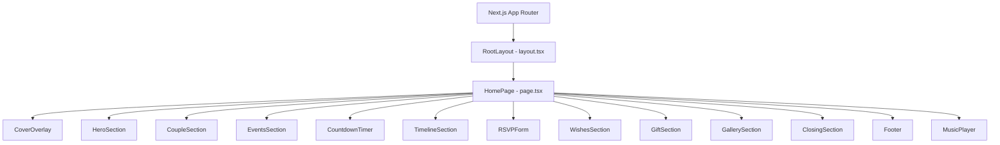

# Design Document: Wedding Website Clone

## Overview

This design describes a single-page wedding invitation website cloned from the Aswana Premium Template (nauhin.com). The app is built with Next.js App Router (TypeScript) and Tailwind CSS. It renders all sections on a single page behind a cover overlay. Dismissing the overlay reveals the content and starts background music. All content is in Indonesian (Balinese wedding context).

The site is fully client-rendered for interactive parts (countdown, forms, music player) and statically rendered for content sections. No backend/database is needed — form submissions (RSVP, wishes) are handled client-side with local state.

## Architecture

### High-Level Architecture



### Rendering Strategy

- The page is a single Next.js route (`/`) using the App Router.
- The root `page.tsx` is a server component that composes all section components.
- Interactive components (`CoverOverlay`, `CountdownTimer`, `RSVPForm`, `WishesForm`, `GiftSection`, `MusicPlayer`) are client components (`"use client"`).
- Static content sections (`HeroSection`, `CoupleSection`, `EventsSection`, `TimelineSection`, `GallerySection`, `ClosingSection`, `Footer`) are server components.

### State Management

- **Cover overlay state**: A `useState` boolean in the page-level client wrapper controls overlay visibility. Dismissing it triggers a CSS fade-out transition and starts music playback.
- **Music player state**: A `useState` boolean tracks play/pause. An `HTMLAudioElement` ref handles playback. State is lifted to the page level so the cover overlay button can trigger play.
- **Countdown state**: A `useState` + `useEffect` with `setInterval` computes time remaining every second. Client-only rendering via `useEffect` avoids hydration mismatch.
- **RSVP form state**: Local `useState` for form fields and submission status.
- **Wishes state**: Local `useState` for form fields and an array of submitted wishes.
- **Clipboard state**: Transient `useState` for copy confirmation feedback.

## Components and Interfaces

### Project Structure

```
src/
  app/
    layout.tsx          # RootLayout: html, body, fonts, metadata
    page.tsx            # HomePage: composes all sections
    globals.css         # Tailwind directives + custom styles
  components/
    CoverOverlay.tsx    # Full-screen overlay with dismiss button
    HeroSection.tsx     # Couple names, date, blessing quote
    CoupleSection.tsx   # Bride & groom profiles
    EventsSection.tsx   # Ceremony & reception details
    CountdownTimer.tsx  # Live countdown to wedding date
    TimelineSection.tsx # Love story milestones
    RSVPForm.tsx        # RSVP attendance form
    WishesSection.tsx   # Wishes form + wishes list
    GiftSection.tsx     # Bank details + copy button
    GallerySection.tsx  # Photo grid
    ClosingSection.tsx  # Thank-you message
    Footer.tsx          # Credits
    MusicPlayer.tsx     # Floating play/pause control
  lib/
    constants.ts        # Wedding date, couple info, timeline data, bank details, image URLs
tailwind.config.ts      # Tailwind config with custom colors/fonts
next.config.ts          # Next.js config
tsconfig.json
package.json
```

### Component Interfaces

#### CoverOverlay
```typescript
interface CoverOverlayProps {
  onOpen: () => void; // Called when "Buka Undangan" is clicked
}
```
- Renders full-screen fixed overlay with z-50
- Fade-out animation on dismiss (CSS transition on opacity)
- Calls `onOpen` which triggers overlay hide + music play

#### CountdownTimer
```typescript
// No props — reads target date from constants
// Client component with useEffect interval
```
- Computes diff between now and wedding date
- Displays days/hours/minutes/seconds boxes
- Shows 0/0/0/0 when date has passed
- Renders placeholder on server, hydrates on client

#### RSVPForm
```typescript
// No props — self-contained form with local state
interface RSVPFormData {
  name: string;
  attendance: "hadir" | "tidak_hadir";
}
```
- Validates name is non-empty before submit
- Shows success message after submission
- Dropdown/select for attendance status

#### WishesSection
```typescript
// No props — self-contained
interface Wish {
  id: number;
  name: string;
  message: string;
  timestamp: Date;
}
```
- Form with name + message fields
- Validates both fields non-empty
- Appends to local wishes array on submit
- Renders scrollable wish list below form

#### GiftSection
```typescript
// No props — reads bank info from constants
```
- Displays bank name, account number, holder name
- Copy button uses `navigator.clipboard.writeText()`
- Shows brief "Tersalin!" confirmation via transient state

#### MusicPlayer
```typescript
interface MusicPlayerProps {
  isPlaying: boolean;
  onToggle: () => void;
}
```
- Floating fixed button (bottom-right corner)
- Animated icon indicates play/pause state (spinning disc or pulsing icon)
- Audio element with `loop` attribute

### Page-Level Client Wrapper

Since the page needs to coordinate overlay dismiss → music play, a client wrapper component manages shared state:

```typescript
// ClientWrapper wraps all sections
interface ClientWrapperState {
  isOverlayVisible: boolean;
  isMusicPlaying: boolean;
}
```

## Data Models

### Constants (lib/constants.ts)

```typescript
export const WEDDING_DATE = new Date("2025-04-09T13:00:00+08:00");

export const COUPLE = {
  groom: {
    name: "Anak Agung Gde Bagus Artha Wiguna, S.Tr.AB",
    shortName: "Gung Gus",
    birthOrder: "Putra pertama dari",
    parents: "Anak Agung Gde Oka Artha Wiguna & Anak Agung Istri Mas Kencanawati",
    address: "Br. Dinas Belong, Desa Adat Belong, Kec. Bebandem, Kab. Karangasem",
  },
  bride: {
    name: "I Gusti Ayu Agung Sonia Shafna, S.Tr.Akt., M.Ak",
    shortName: "Sonia",
    birthOrder: "Putri pertama dari",
    parents: "I Gusti Agung Gde Oka Putra, S.E. & I Gusti Ayu Agung Mas Laksmi, S.E.",
    address: "Br. Dinas Kawan, Desa Adat Selat, Kec. Selat, Kab. Karangasem",
  },
};

export const EVENTS = {
  ceremony: {
    title: "Upacara Pernikahan",
    date: "Rabu, 09 April 2025",
    time: "Pukul 13.00 - Selesai",
    location: "Kediaman Mempelai Pria",
    address: "Br. Dinas Belong, Desa Adat Belong, Kec. Bebandem, Kab. Karangasem",
  },
  reception: {
    title: "Resepsi Pernikahan",
    date: "Rabu, 09 April 2025",
    time: "Pukul 13.00 - Selesai",
    location: "Kediaman Mempelai Pria",
    address: "Br. Dinas Belong, Desa Adat Belong, Kec. Bebandem, Kab. Karangasem",
  },
};

export const TIMELINE_MILESTONES = [
  { title: "Awal Bertemu", description: "Pertemuan pertama kami di acara kampus..." },
  { title: "Menjalin Hubungan", description: "Kami memutuskan untuk bersama..." },
  { title: "Berkomitmen", description: "Kami mulai membicarakan masa depan..." },
  { title: "Menikah", description: "Memulai babak baru kehidupan bersama..." },
];

export const BANK_INFO = {
  bankName: "Bank BCA",
  accountNumber: "1234567890",
  accountHolder: "Anak Agung Gde Bagus Artha Wiguna",
};

export const GALLERY_IMAGES: string[] = [
  // 6+ image URLs from reference or placeholders
];
```

### Form State Models

RSVP and Wishes forms use local component state only. No persistence layer — data lives in React state for the session.

## Error Handling

| Scenario | Handling |
|---|---|
| RSVP form submitted with empty name | Show inline validation error "Nama harus diisi" |
| Wishes form submitted with empty fields | Show inline validation error for each empty field |
| Clipboard API not available | Fallback: select text in a hidden input for manual copy, or show the number prominently |
| Audio fails to load/play | Silently catch error, hide music player or show disabled state |
| Countdown target date in the past | Display 0 for all units |
| Image fails to load | Show placeholder background color via Tailwind `bg-gray-200` |
| Hydration mismatch on countdown | Render empty/placeholder on server, populate via `useEffect` on client |

## Testing Strategy

### Why Property-Based Testing Does Not Apply

This feature is a UI-heavy wedding invitation website. It consists primarily of:
- Static content rendering (couple info, event details, timeline)
- UI layout and visual design (responsive grids, animations, fonts)
- Simple form interactions with local state (RSVP, wishes)
- Side-effect operations (clipboard copy, audio playback)
- A straightforward date-difference countdown

There are no parsers, serializers, complex data transformations, or algorithms with large input spaces. PBT is not the right tool here.

### Recommended Testing Approach

**Unit Tests (Vitest + React Testing Library)**:
- CountdownTimer: verify it renders correct time diff for a mocked date, shows zeros when date is past
- RSVPForm: verify validation rejects empty name, shows success on valid submit
- WishesSection: verify wish appears in list after submit, validation rejects empty fields
- GiftSection: verify copy button calls clipboard API
- CoverOverlay: verify onOpen callback fires on button click

**Visual / Snapshot Tests**:
- Snapshot each section component to catch unintended markup changes
- Verify responsive layout classes are present

**Manual Testing**:
- Cross-browser audio playback behavior
- Smooth scroll behavior
- Fade-in animations on scroll
- Visual fidelity comparison with reference site
- Mobile touch interactions (tappable elements, scrollable wish list)

**Integration Tests**:
- Full page render: overlay visible → click "Buka Undangan" → overlay fades → music plays
- Submit RSVP → success message appears
- Submit wish → wish appears in list
- Click copy → clipboard contains account number
